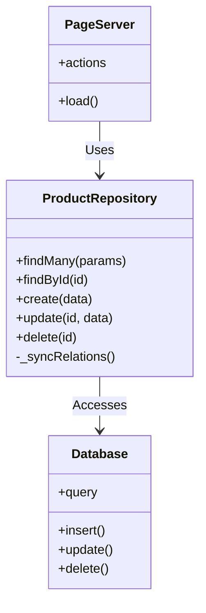
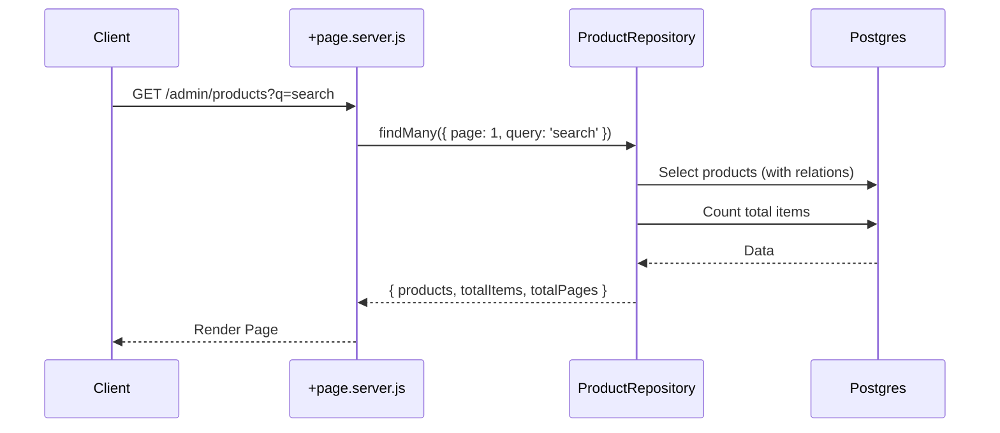
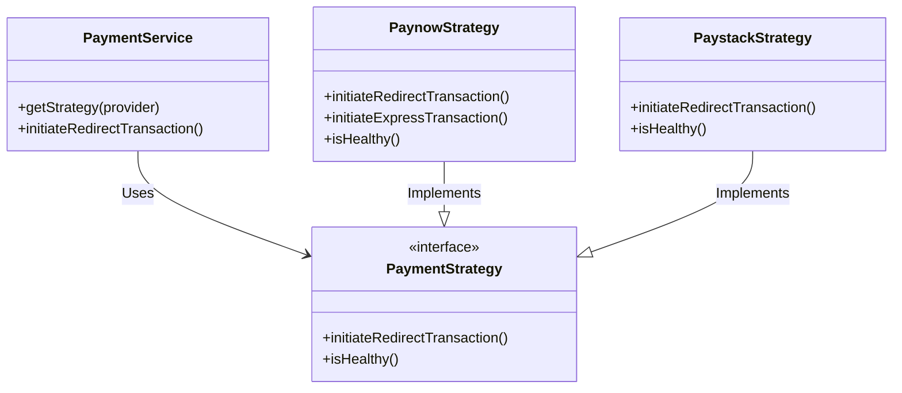
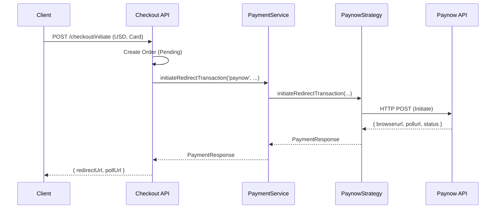
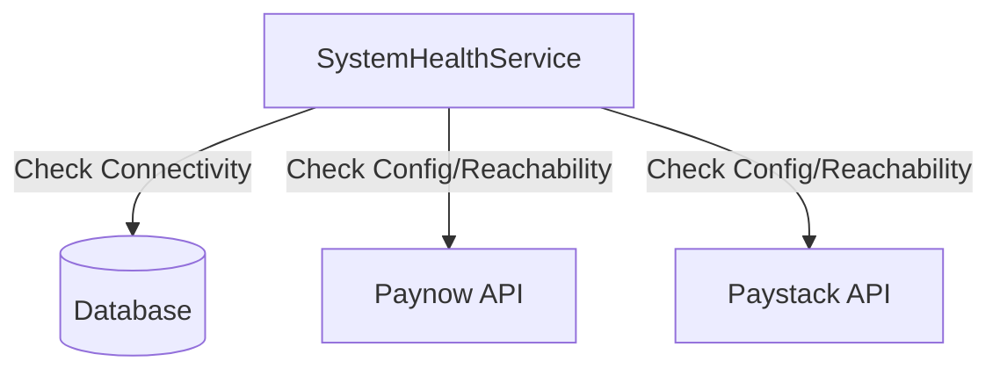

# Architecture Documentation

This document outlines the new architecture introduced to decouple business logic from the UI layer in the `vision-ai.tech` codebase.

## Overview

We have introduced two key patterns:
1.  **Repository Pattern**: To abstract database interactions
2.  **Strategy Pattern**: To handle multiple payment providers seamlessly

## 1. Repository Pattern

### Purpose
The Repository pattern isolates the data access logic from the SvelteKit `+page.server.js` (Controller) layer. This allows:
-   Easier testing (mocking repositories)
-   Centralized data logic (consistent queries)
-   Clean UI code (focused on adapting data for the view).

### Implementation
We created `ProductRepository` and `UserRepository` in `$lib/server/repositories`.

#### Class Diagram

#### Example Flow (Admin Products Load)

## 2. Strategy Pattern (Payments)

### Purpose
The Strategy pattern allows the application to switch between different payment providers (Paynow, Paystack) dynamically without cluttering the main service logic with `if/else` checks for every provider.

### Implementation
-   **Context**: `PaymentService` (Factory + Execution)
-   **Interface**: `PaymentStrategy`
-   **Concrete Strategies**: `PaynowStrategy`, `PaystackStrategy`

#### Class Diagram

#### Example Flow (Checkout Initiation)

## 3. System Health

We added a `SystemHealthService` to verify the status of these critical components.

