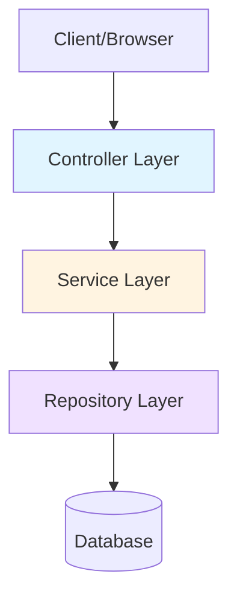

# System Architecture Design

## Overview

This application follows a **three-tier layered architecture** to ensure separation of concerns, maintainability, and testability.

## Architecture Layers



### 1. Controller Layer (Routes)
**Location**: `src/routes/**/*.server.js`

**Responsibilities**:
- Handle HTTP requests and responses
- Validate and sanitize user input
- Call service methods with prepared data
- Format responses for the client
- Manage cookies and sessions
- Handle redirects

**Rules**:
- ✅ **CAN** import and use Services
- ✅ **CAN** use SvelteKit utilities (`error`, `redirect`, `cookies`)
- ✅ **CAN** use validation libraries (e.g., `zod`)
- ❌ **CANNOT** import `$lib/server/db`
- ❌ **CANNOT** import Repositories
- ❌ **CANNOT** contain business logic

**Example**:
```javascript
// ✅ CORRECT
import { BlogService } from '$lib/server/services/BlogService';

export async function load() {
    const service = new BlogService();
    const { posts } = await service.listPosts({ publishedOnly: true });
    return { posts };
}

// ❌ INCORRECT - Direct DB access
import { db } from '$lib/server/db';
export async function load() {
    const posts = await db.query.blogPost.findMany();
    return { posts };
}

// ❌ INCORRECT - Direct Repository access
import { BlogRepository } from '$lib/server/repositories/BlogRepository';
export async function load() {
    const repo = new BlogRepository();
    const posts = await repo.findMany();
    return { posts };
}
```

---

### 2. Service Layer
**Location**: `src/lib/server/services/**/*.js`

**Responsibilities**:
- Implement business logic
- Orchestrate multiple repository calls
- Apply business rules and validations
- Transform data for controllers
- Handle transactions across multiple repositories
- Log significant business events

**Rules**:
- ✅ **CAN** import and use Repositories
- ✅ **CAN** import other Services (for cross-domain operations)
- ✅ **CAN** use `LoggerService` for logging
- ✅ **CAN** use utility functions (password hashing, email, etc.)
- ❌ **CANNOT** import `$lib/server/db`
- ❌ **CANNOT** use Drizzle ORM query methods directly
- ❌ **CANNOT** handle HTTP-specific logic (cookies, redirects)

**Example**:
```javascript
// ✅ CORRECT
import { BlogRepository } from '$lib/server/repositories/BlogRepository';
import { LoggerService } from '$lib/server/services/LoggerService';

const logger = LoggerService.for('BlogService');

export class BlogService {
    constructor() {
        this.repo = new BlogRepository();
    }

    async createPost(userId, data) {
        // Business logic here
        const post = await this.repo.create(data);
        logger.info(`User ${userId} created blog post ${post.id}`);
        return post;
    }
}

// ❌ INCORRECT - Direct DB access
import { db } from '$lib/server/db';
import { blogPost } from '$lib/server/db/schema';

export class BlogService {
    async createPost(data) {
        // Direct DB access is not allowed in services
        const [post] = await db.insert(blogPost).values(data).returning();
        return post;
    }
}
```

---

### 3. Repository Layer
**Location**: `src/lib/server/repositories/**/*.js`

**Responsibilities**:
- Provide data access methods
- Execute database queries
- Map database results to application models
- Handle database-specific concerns (transactions, connections)
- Provide CRUD operations

**Rules**:
- ✅ **CAN** import `$lib/server/db`
- ✅ **CAN** use Drizzle ORM methods
- ✅ **CAN** import database schema definitions
- ✅ **CAN** use `LoggerService` for logging
- ❌ **CANNOT** contain business logic
- ❌ **CANNOT** call other Services
- ❌ **CANNOT** handle authentication/authorization

**Example**:
```javascript
// ✅ CORRECT
import { db } from '$lib/server/db';
import { blogPost } from '$lib/server/db/schema';
import { desc, eq } from 'drizzle-orm';

export class BlogRepository {
    async findMany({ limit = 20 } = {}) {
        return db.query.blogPost.findMany({
            orderBy: desc(blogPost.id),
            limit
        });
    }

    async create(data) {
        const [post] = await db.insert(blogPost).values(data).returning();
        return post;
    }
}
```

---

## Data Flow Patterns

### Read Operation
```
1. User makes request
2. Controller receives request
3. Controller calls Service method
4. Service calls Repository method(s)
5. Repository queries Database
6. Database returns raw data
7. Repository returns data to Service
8. Service applies business logic/transformations
9. Service returns processed data to Controller
10. Controller formats and sends response
```

### Write Operation
```
1. User submits data
2. Controller validates input (basic validation)
3. Controller calls Service method with validated data
4. Service applies business rules
5. Service calls Repository method(s)
6. Repository executes database insert/update
7. Repository returns created/updated entity
8. Service logs the operation
9. Service returns result to Controller
10. Controller sends success response or redirect
```

---

## Architectural Principles

### Single Responsibility
Each layer has a clear, singular purpose:
- **Controllers**: HTTP handling
- **Services**: Business logic
- **Repositories**: Data access

### Dependency Direction
Dependencies flow in one direction:
```
Controllers → Services → Repositories → Database
```

### No Layer Skipping
Each layer must go through the layer below it. Controllers cannot skip Services to call Repositories directly.

### Testability
- Services should be testable without HTTP context
- Repositories should be testable with mock databases
- Controllers should be testable with mocked Services

---

## Current Implementation Status

### ✅ Compliant Routes
- `(auth)/login/+page.server.js` - Uses `AuthService`
- `(auth)/register/+page.server.js` - Uses `AuthService`
- `(public)/+page.server.js` - Uses multiple services
- `(public)/blog/+page.server.js` - Uses `BlogService`
- `(public)/case-studies/+page.server.js` - Uses `CaseStudyService`
- `sitemap.xml/+server.js` - Uses multiple services
- `r/[shortCode]/+server.js` - Uses `TrackedLinkService`

### 🔍 Needs Audit
Files that may have direct database access or architectural violations will be identified and documented in `todo.md`.

---

## Exception Handling

### Service Layer
Services should throw meaningful errors that controllers can catch and translate into HTTP responses:

```javascript
// In Service
if (!post) {
    throw new Error('Post not found');
}

// In Controller
try {
    const post = await service.getPost(id);
    return { post };
} catch (err) {
    throw error(404, err.message);
}
```

### Repository Layer
Repositories should let database errors bubble up but can add context:

```javascript
try {
    return await db.insert(table).values(data).returning();
} catch (err) {
    logger.error('Database error', err);
    throw err; // Let service handle it
}
```

---

## Migration Strategy

For files that don't follow this architecture:

1. **Identify**: Find all direct database imports in routes
2. **Check Repository**: Ensure repository exists with needed methods
3. **Check Service**: Ensure service exists and calls repository
4. **Refactor Route**: Update route to call service instead of db
5. **Test**: Verify functionality remains unchanged
6. **Document**: Add comments explaining the pattern

---

## Related Documentation

- See `todo.md` for pending architectural fixes
- See `README.md` for developer guidelines
- See individual service/repository files for detailed method documentation
